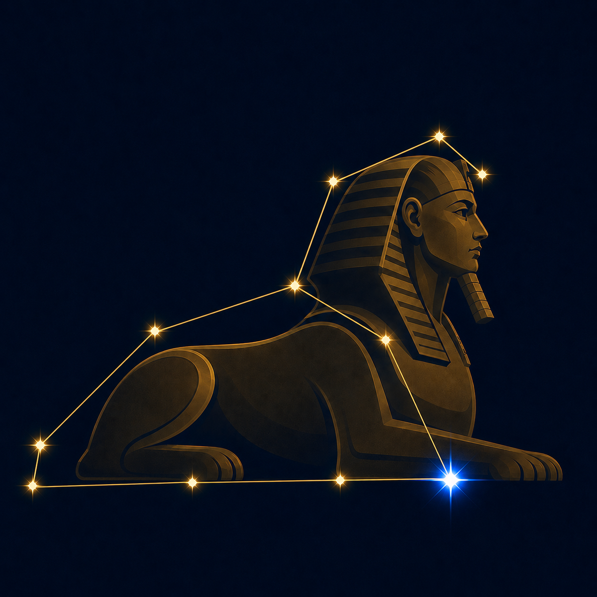

# guidestar



A set of tools to help keep demos and documentation up to date with the source code 
of a package.  This includes a reusable Sphinx extension for embedding interactive wireframe demos into the documentation as well as a GitHub action workflow which helps to ensure the wireframe and scripts themselves stay in sync with changes to the source code.  The rendered
demos step through a configurable sequence of actions, including optional transcripts, and provides play/pause/start controls.

**Disclaimer**: this project was largely developed using agentic AI assistants.

## Installation

```bash
pip install sphinx-guidestar
```

Or for development:

```bash
pip install -e /path/to/sphinx-guidestar
```

## Quick start

Enable the extension in your Sphinx `conf.py`:

```python
extensions = [
    "guidestar",
]
```

Then use the directive in any RST file:

```rst
.. guidestar-demo:: _static/my-app.html
   :steps: #btn@1500:click, .panel@1000:toggle-class=open
   :repeat: true
   :height: 500px
```

## Directive options

| Option                 | Description                                                       | Default  |
| ---------------------- | ----------------------------------------------------------------- | -------- |
| `:steps:`              | Comma-separated shorthand step strings                            | *(none)* |
| `:steps-json:`         | Inline JSON array of step objects (alternative to `:steps:`)      | *(none)* |
| `:repeat:`             | Loop the demo when it finishes (`true` / `false`)                 | `true`   |
| `:auto-start:`         | Start automatically when the container scrolls into view          | `true`   |
| `:pause-on-interaction:` | Pause when the user clicks inside the demo                      | `true`   |
| `:css:`                | Path to an additional CSS file to include                         | *(none)* |
| `:js:`                 | Path to an additional JS file to include                          | *(none)* |
| `:id:`                 | Explicit container id (auto-generated if omitted)                 | *(auto)* |
| `:height:`             | Container height, e.g. `500px`                                    | *(none)* |
| `:initial-class:`      | CSS class(es) added to the content root on load                   | *(none)* |

## Step syntax

### Shorthand string

```
target@delay:action=value|caption text
```

| Part       | Description                                                    | Default     |
| ---------- | -------------------------------------------------------------- | ----------- |
| `target`   | CSS selector for the element to act on                         | *(none)*    |
| `@delay`   | Milliseconds to wait before the next step; append `!` to suppress highlight | `2000` |
| `:action`  | Action name (`click`, `add-class`, `toggle-class`, …)          | `highlight` |
| `=value`   | Value passed to the action                                     | *(none)*    |
| `\|text`  | Optional caption text shown as a semi-transparent overlay       | *(none)*    |

Caption text is separated from the rest of the step by a `|` pipe character.
Prefix the text with `^` to force the caption to the **top**, or `v` to force
it to the **bottom**. Without a prefix the position is chosen automatically
(opposite the target element).

```
#btn@1500:click|Click the button           → auto-positioned caption
#btn@1500:click|^Click the button           → forced to top
#sidebar@800:toggle-class=open|vOpening…    → forced to bottom
```

### JSON step object

```json
{
  "target": "#my-btn",
  "action": "click",
  "delay": 1500,
  "noHighlight": true,
  "caption": "Click the button to proceed",
  "captionOptions": {
    "position": "bottom",
    "className": "my-custom-caption"
  }
}
```

| Field            | Description                                                             |
| ---------------- | ----------------------------------------------------------------------- |
| `caption`        | Text shown as a semi-transparent overlay during this step               |
| `captionOptions` | Optional object with `position` (`"top"`, `"bottom"`, or `"auto"`) and/or `className` (extra CSS class) |

### Built-in actions

`highlight`, `click`, `add-class`, `remove-class`, `toggle-class`,
`set-attribute`, `remove-attribute`, `set-value`, `set-text`, `set-html`,
`scroll-into-view`, `dispatch-event`, `pause`.

### Custom actions

Register custom actions from a separate JS file loaded via the `:js:` option:

```js
Guidestar.registerAction('my-action', function (step, el, contentRoot) {
    // `this` is the Guidestar instance
    // `step` has .target, .action, .value, .delay
    // `el` is the resolved DOM element (or null)
    // `contentRoot` is the container holding the fetched HTML
});
```

## Styling the control button

The play/pause/restart button lives inside a Shadow DOM for style isolation.
It exposes **CSS custom properties** that you can set on the
`[data-guidestar]` container (or any ancestor) to theme the button
without breaking encapsulation.

### Available custom properties

| Custom property              | What it controls           | Default                 |
| ---------------------------- | -------------------------- | ----------------------- |
| `--gs-control-size`         | Button width & height      | `44px`                  |
| `--gs-control-radius`       | Border-radius              | `8px`                   |
| `--gs-control-bg`           | Background color           | `rgba(0,0,0,0.55)`     |
| `--gs-control-bg-hover`     | Background on hover        | `rgba(0,0,0,0.75)`     |
| `--gs-control-border`       | Border shorthand           | `none`                  |
| `--gs-control-color`        | Icon / text color          | `#fff`                  |
| `--gs-control-icon-size`    | SVG icon width & height    | `22px`                  |
| `--gs-control-bottom`       | Bottom offset              | `12px`                  |
| `--gs-control-right`        | Right offset               | `12px`                  |
| `--gs-control-tooltip-bg`   | Tooltip background         | `rgba(0,0,0,0.8)`      |
| `--gs-control-tooltip-color`| Tooltip text color         | `#fff`                  |

### Example: theming the control downstream

In your project's CSS file (e.g. `_static/my-wireframe.css`), override
any combination of properties:

```css
/* Dark teal button matching jdaviz branding */
[data-guidestar] {
    --gs-control-bg: rgba(0, 59, 77, 0.9);
    --gs-control-bg-hover: rgba(0, 125, 164, 0.9);
    --gs-control-border: 2px solid rgba(255, 255, 255, 0.2);
    --gs-control-radius: 8px;
    --gs-control-size: 44px;
}
```

You can also scope overrides to light/dark themes:

```css
html[data-theme="light"] [data-guidestar] {
    --gs-control-bg: rgba(0, 0, 0, 0.6);
    --gs-control-bg-hover: rgba(0, 0, 0, 0.8);
}
```

### Styling captions

Caption overlays are styled via CSS custom properties on the
`[data-guidestar]` container:

| Custom property              | What it controls           | Default                 |
| ---------------------------- | -------------------------- | ----------------------- |
| `--gs-caption-bg`           | Background color           | `rgba(0,0,0,0.72)`     |
| `--gs-caption-color`        | Text color                 | `#fff`                  |
| `--gs-caption-font-size`    | Font size                  | `14px`                  |
| `--gs-caption-padding`      | Padding                    | `10px 16px`             |
| `--gs-caption-inset`        | Left & right inset (keeps clear of controls) | `68px` |

```css
[data-guidestar] {
    --gs-caption-bg: rgba(0, 0, 80, 0.8);
    --gs-caption-font-size: 16px;
}
```

You can also apply a per-step custom class via `captionOptions.className`
(in JSON objects) to style individual captions differently.

### Overriding highlight styles

The element highlight (orange pulse) is injected into the main document, so
standard CSS specificity applies:

```css
/* Change highlight to blue */
.gs-highlight {
    animation: none;
    outline-color: rgba(0, 120, 255, 0.7);
}
```

### Overriding controls host positioning

The `.gs-controls-host` class is in the light DOM and can be targeted
directly:

```css
/* Move button to bottom-left */
.gs-controls-host {
    right: auto;
    left: 12px;
}
```

## Programmatic usage

```js
const demo = new Guidestar(containerElement, {
    htmlSrc: '_static/app.html',
    steps: [
        '#btn@1500:click|Click the button',
        { target: '.panel', action: 'toggle-class', value: 'open', delay: 1000,
          caption: 'Opening the panel', captionOptions: { position: 'bottom' } }
    ],
    repeat: true,
    autoStart: true,
    pauseOnInteraction: true,
    onStepStart: function (index, step) { },
    onStepEnd: function (index, step) { },
    onComplete: function () { }
});

// Control playback
demo.pause();
demo.play();
demo.restart();
demo.destroy();
```

## License

BSD 3-Clause
